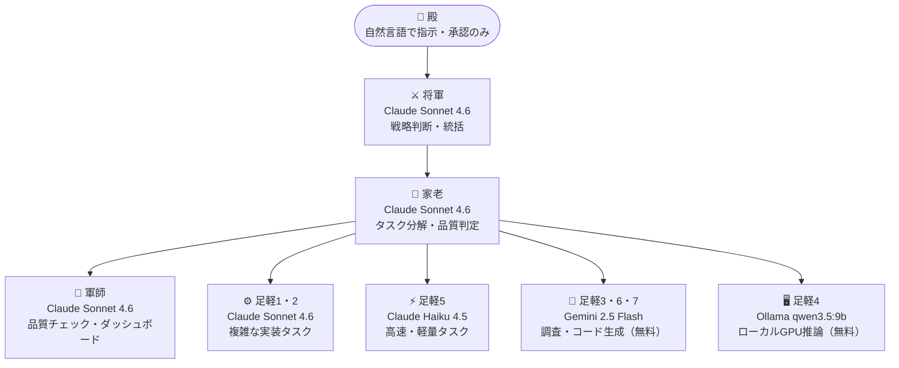

## はじめに

Gemini CLI に `inbox3` というシグナルを送ったとき、こんな返答が来ました。

> I'm not sure what "inbox3" refers to. Could you please clarify your request?

この問題の発見から解決までが、この記事の核心です。前半は問題が起きた環境の説明（構成・コスト）で、解決策は「詰まった：Gemini CLI が inbox を処理できない問題」のセクションから始まります。

背景を補足すると、[multi-agent-shogun](https://github.com/yohey-w/multi-agent-shogun) という、Claude Code を複数起動してマルチエージェント開発環境を構築するOSSプロジェクトがあります。おしおさんの[紹介記事](https://zenn.dev/shio_shoppaize/articles/5fee11d03a11a1)を読んで「これは試してみたい」と思ったのが始まりで、気づいたら自分の環境に合わせてかなりカスタマイズしていました。この記事は、その過程で**詰まったこと・工夫したこと・気づいたこと**を書いた体験記です。

なお、本記事で紹介しているカスタマイズは、設計と判断は自分でやって、コードはエージェントに書かせました。この体験記自体がマルチエージェント開発の産物です。

:::message
本記事はmulti-agent-shogunをベースにしています。素晴らしいプロジェクトを公開してくださっているおしおさんに感謝します。
:::

---

## 最初の構成と課題

最初は**Claude Pro（$20/月）** を軸にしたミニマム構成で始めました。Claude の使用量を節約するため、軍師を無料の Gemini CLI に、一部の足軽（Ashigaru）を無料のローカル LLM（Ollama）に振り分ける方針です。

ところが実際に動かしてみると、わりとすぐに2つの壁にぶつかりました。

### 壁1：ローカルLLMが指示をループし続ける

家老（Karo）から足軽に「このファイルを修正して報告せよ」と指示を送っても、Ollama（qwen2.5:7b）が意図を正しく汲み取れず、同じ操作を繰り返したり、まったく別の処理を始めたりするケースが頻発しました。

そのたびに手動でリセットする羽目になり、「自律実行」とはほど遠い状態でした。

### 壁2：Claude Pro の5時間レート制限

Claude Pro には一定時間ごとの使用量（メッセージ量）に対するレート制限があります。複数の Claude インスタンスを同時に動かすと、その分メッセージの消費が早まり、思っていた以上に早く上限に達してしまって、作業の勢いがそこで途切れてしまいます。

---

## Claude Max 5x への移行と設計方針

これらを解消するため、**Claude Max 5x（$100/月）** に移行しました。

あわせて Ollama 側も見直しました。ローカル GPU は RTX 4060 Ti 8GB が1枚で、`qwen3.5:9b` クラスは実質1体しか同時推論できません。そこで Ollama 担当の足軽は1体に保ったまま、初期に使っていた `qwen2.5:7b` を**より性能の高い `qwen3.5:9b` に格上げ**しました。台数を増やすのではなく、1体の賢さを上げる判断です。

ただ、「全員 Claude Sonnet にすればいい」という発想にはなりませんでした。Gemini CLI（無料）と Ollama（ローカル GPU）を残すことで、こんなバランスを取っています。

- **Claude 枠の節約**：単純なタスクは Gemini や Ollama に回す
- **Claude のレート制限保険**：仮に Claude が詰まっても Gemini/Ollama は動き続ける
- **ローカル GPU の活用**：プライバシーが気になるコードはローカルで完結

---

## 7名ハイブリッド構成の全体像

現在の構成はこうなっています。



| エージェント | CLI | モデル | 用途 |
|---|---|---|---|
| 将軍・家老・軍師 | Claude Code | Sonnet 4.6 | 指揮・判断・品質管理 |
| 足軽1/2 | Claude Code | Sonnet 4.6 | 複雑な実装タスク |
| 足軽3/6/7 | Gemini CLI | Gemini 2.5 Flash | 調査・コード生成（無料枠） |
| 足軽4 | OpenCode | Ollama qwen3.5:9b | ローカルGPU推論 |
| 足軽5 | Claude Code | Haiku 4.5 | 軽量・高速タスク |

### コスト構成

| 項目 | コスト |
|---|---|
| Claude Max 5x（将軍・家老・軍師・足軽1/2/5） | $100/月（固定） |
| Gemini CLI（足軽3/6/7） | 無料 |
| Ollama（足軽4） | 無料（電気代のみ） |
| **合計** | **$100/月** |

---

## 詰まった：Gemini CLI が inbox を処理できない問題

ここが今回の記事でいちばん伝えたい部分です。

multi-agent-shogun では、エージェント間の通信に**ファイルベースの inbox システム**を使っています。家老が足軽に仕事を頼むとき、こんな流れで動きます。

```
家老 → inbox.yaml に書き込み
     → inbox_watcher.sh が変更を検知
     → "inbox3" という短いシグナルを tmux send-keys で足軽のペインに送信
     → 足軽が inbox.yaml を読んでタスクを実行
```

Claude Code はこの「inbox3」を受け取ると「3件の未読メッセージがある」と解釈してファイルを読みに行きます。

**ところが Gemini CLI と OpenCode は「inbox3」の意味がわからない。**

Gemini CLI に「inbox3」を送ると、返ってくるのはこれです。

```
I'm not sure what "inbox3" refers to. Could you please clarify your request?
```

さらに Gemini CLI は `queue/inbox/` ディレクトリへのアクセスを「Path not in workspace」として弾くこともありました。ファイルを読もうにも読めない、という状態です。

### 解決策：inbox_watcher.sh でCLI種別を判定する

`scripts/inbox_watcher.sh` を修正して、エージェントの CLI 種別に応じて送信内容を変えるようにしました。

```bash
# nudge を送る直前に CLI 種別を取得する
local effective_cli_for_nudge
effective_cli_for_nudge=$(get_effective_cli_type)
# get_effective_cli_type() は tmux ペインの @agent_cli 属性を優先して読み取り、
# 未設定の場合は inbox_watcher.sh 起動時の引数（CLI_TYPE）にフォールバックする。
# switch_cli.sh がペイン切替時に @agent_cli を更新するため、
# 設定ファイルの値ではなく実際に動いている CLI を動的に判定できる。

if [[ "$effective_cli_for_nudge" == "opencode" ]] || \
   [[ "$effective_cli_for_nudge" == "gemini" ]]; then
    # Gemini/OpenCode には明示的な指示文を送る
    nudge="queue/inbox/${AGENT_ID}.yaml と \
           queue/tasks/${AGENT_ID}.yaml を Read して \
           タスクを実行せよ。完了後 inbox_write.sh で軍師に報告すること。"
fi
```

加えて、Gemini/OpenCode は inbox の既読処理（`read: false → true`）も自律的にできないため、`inbox_watcher.sh` 側で自動的に既読にする処理も追加しました。

```bash
if [[ "$effective_cli_for_nudge" == "gemini" ]] || \
   [[ "$effective_cli_for_nudge" == "opencode" ]]; then
    python3 -c "
import re
path = '${INBOX}'
with open(path, 'r') as f:
    content = f.read()
# 行頭のインデントを含めてマッチさせることで、
# タスク内容に 'read: false' という文字列が含まれていても
# 誤置換しないようにしている
updated = re.sub(r'^(\s+read: )false', r'\1true', content, flags=re.MULTILINE)
with open(path, 'w') as f:
    f.write(updated)
" 2>/dev/null || true
fi
```

:::message
`re.sub(r'read: false', ...)` のような単純なパターンだと、タスクの説明文に `read: false` という文字列が含まれていた場合に誤置換するリスクがあります。YAMLの `read` キーは必ずインデントされた位置にあるため、`^(\s+read: )false` のように行頭のインデントを含めてマッチさせることで安全に置換できます。
:::

なお、upstream には [`.opencode/tools/mark-as-read.ts`](https://github.com/yohey-w/multi-agent-shogun/blob/main/.opencode/tools/mark-as-read.ts) という既読処理ツールが存在します。本記事の `inbox_watcher.sh` 側での既読処理は、Gemini CLI を含む複数 CLI を一括対応するための設計判断として採用しました。

この修正により、Gemini CLI と OpenCode も同一パイプラインで動かせるようになりました。実装の全体は[scripts/inbox_watcher.sh](https://github.com/shun2580/multi-agent-shogun/blob/main/scripts/inbox_watcher.sh)を参照してください。`get_effective_cli_type` 関数あたりから読むとわかりやすいです。

---

## 自律稼働のために追加した仕組み

せっかくマルチエージェントを動かすなら「指示を出したら完成まで自律稼働してほしい」というのが本音です。そのためにいくつか仕組みを足しました。

### スマホへのプッシュ通知（ntfy）

[ntfy](https://ntfy.sh/)（無料のプッシュ通知サービス）を使って、cmd完了・エラー・要対応イベントをスマホにリアルタイム通知するようにしました。

```bash
# 家老が cmd 完了時に通知を送る
bash scripts/ntfy.sh "✅ cmd_XXX 完了 — {概要}"
```

「指示を出して離席 → 完了通知が来たら確認」というフローができて、作業が劇的にラクになりました。

### 家老の自己 /clear 機構

Claude Code はコンテキストが積み上がるにつれて応答が重くなり、最終的には `/clear` でリセットが必要になります。ただ家老が「そろそろリセットしないと」と判断しても、自分自身に `/clear` を送る手段がありませんでした。

`scripts/inbox_write.sh` に `clear_command` タイプの self-send を許可する例外を追加して、家老が自律的にリセットできるようにしました。

```bash
# 家老がコンテキスト高騰を感じたときに実行
bash scripts/inbox_write.sh karo "" clear_command karo
```

### 足軽が5分無応答なら別エージェントへ自動再割当て

指示を出して離席し、戻ってきたら何時間も同じ状態で待機したままだったことがありました。Gemini や OpenCode はタスクを受け取っても黙ったまま止まることがあり、外から見ると処理中なのか止まっているのか判別できません。5分以上応答がない場合は別の足軽に再割り当てするルールを家老の指示書に追加しました。

---

## GPU VRAM が Ollama の壁を決める

先述のとおり Ollama（足軽4）はローカル GPU 1枚に縛られ、同時に動かせるのは1体が限界です。一方 Gemini CLI は GPU を使わないので VRAM 消費はゼロ。足軽3/6/7 として3体を並列で動かせます。同じ「無料枠」でも並列度がまるで違うこの差が、「重いタスクは Sonnet、軽くて数を捌きたいタスクは Gemini、ローカルで完結させたいタスクは Ollama」という使い分けに効いています。

---

## やってみてわかったこと

今回いちばんの気づきは、**詰まりの原因が「CLIの性能」ではなく「プロトコルの非互換」だった**ことです。最初は Gemini CLI が賢くないから inbox を処理できないのだと思っていました。でも実際には「inbox3 という文字列の意味を知らないだけ」で、明示的な指示文を送ればちゃんと動く。モデルの賢さを疑う前に、まず通信プロトコルの前提を確認すべきでした。

もう一つ痛感したのが、**「動いているように見えて動いていない」状態の怖さ**です。Gemini が inbox を読めないまま待機していても、外から見ると静止しているだけで判別できません。家老もずっと「足軽が作業中」と思って待ち続けます。数時間後に何も進んでいないことに気づいたときの徒労感は地味にきつかったです。タイムアウトと自動再割当てを入れて初めて、ようやく安定して回るようになりました。

コスト面では、**Sonnet を使うかどうかはタスクの複雑さで判断する**のが正解でした。最初は「どうせ使うなら全員 Sonnet にすればいい」と思っていたのですが、想定より早く Claude 枠が枯渇して作業が止まったことで考えを改めました。YAML の1フィールドを書き換えるだけでも Sonnet を使うと同じだけ枠を消費します。単純なタスクを Haiku や Gemini に振ることで、複雑なタスクのための Claude 枠を確保できます。

最後に、異種 CLI を同一システムで動かす場合は**各 CLI の癖を吸収する中間層が不可欠**だと感じました。最初は各CLIの挙動を個別に修正しようとして、直すたびに別の箇所が崩れるループにはまっていました。今回の inbox_watcher.sh の改修がまさにそれで、「プロトコルの違いをシステム側で吸収する」という発想がないと、どこかで必ず詰まります。

---

## おわりに

multi-agent-shogun、思っていたよりずっとカスタマイズしがいのあるフレームワークでした。壁にぶつかるたびに「なぜそうなっているか」を調べることになって、それが設計理解に直結しました。耐障害性と学習密度の両方が上がる、というのが正直な感想です。

カスタマイズした内容は以下で公開しています。

https://github.com/shun2580/multi-agent-shogun

興味を持っていただけた方はぜひ、おしおさんのオリジナルの記事もあわせてご覧ください。

https://zenn.dev/shio_shoppaize/articles/5fee11d03a11a1

:::message
本記事の誤字脱字チェックにAIを使用しています。
:::
